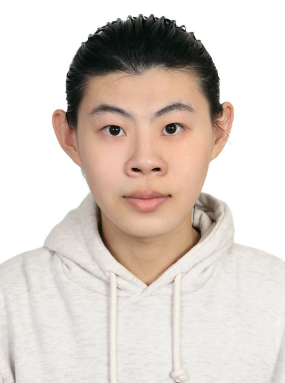

  
  <h1>黃敬汶 (HUNG-WUN HUANG)</h1>
  
<b>Software Engineer & AI/ML Researcher</b>

  
靜宜大學 資訊工程學系（系排名 Top 2.56%）

  

    <a href="mailto:s411147136@gmail.com">Email</a> •
    <a href="https://github.com/HUNG-WUN">GitHub Profile</a> •
    <a href="Resume_Gavin_Huang.pdf">Resume / CV (PDF)</a>
  

---

## 關於我 (About Me)

我是黃敬汶（Gavin），專長領域涵蓋 **深度學習（Medical AI）**、**嵌入式系統與硬體加速（FPGA/Verilog）** 以及 **後端與自動化工具開發**。

在大學期間維持長期優異的學業表現（六學期平均 93.81分，系排名 3/117），並發表多篇國內研討會口頭報告論文。除了學術研究外，亦具備豐富的演算法競賽（ICPC、PUPC、TOPC、CPE）、產學培訓與團隊專案開發經驗。

---

## 精選專案與技術亮點 (Featured Projects)

### 1. 醫療 AI 與電腦視覺 (Medical AI & Computer Vision)
* **梅毒螺旋體抗體檢測影像分析系統 (Syphilis RPR Test Analysis)**
  * 利用 YOLO 物件偵測技術自動辨識 RPR 測試卡反應素凝集影像，建立客觀判定基準，降低臨床人為判讀誤差。
  * **成果**：TANET 2024 口頭報告（第一作者）
  * **技術**：Python, PyTorch, YOLO, OpenCV, Image Augmentation
* **乳房神經纖維瘤辨識系統 (Breast Neurofibroma Identification)**
  * 結合影像擴增與特徵強化技術，輔助醫師診斷罕見乳房腫瘤超音波影像，解決訓練資料稀缺與特徵細微難辨之問題。
  * **成果**：ITAOI 2025 口頭報告（第一作者）
  * **技術**：Python, YOLO, CNN, Grad-CAM, t-SNE

### 2. 硬體加速與嵌入式系統 (Hardware Acceleration & Embedded Systems)
* **基於 FPGA/ASIC 的 Attention 機制硬體加速設計**
  * 針對 Transformer / Attention 機制設計硬體加速架構，將核心拆解為矩陣乘法單元與 Softmax 非線性近似模組，並搭配 Token 剪枝與流水線（Pipeline）架構優化吞吐量。
  * **技術**：Verilog/VHDL, Vivado, ModelSim, FPGA (Basys3/Zynq), C/C++
* **微控制器與物聯網感測警示系統**
  * 使用 TM4C1294 微控制器搭配陀螺儀與 UART 實現即時位移與震動偵測；利用 Verilog 於 FPGA 開發 1-bit MIPS ALU 與可重組邏輯電路。
  * **技術**：ARM Cortex-M4, Verilog, ISE, Vivado, IoT

### 3. 後端架構、自動化與量化工具 (Backend & Automated Systems)
* **高效能遊戲自動化控制引擎**
  * 結合 pure-python-adb 與 OpenCV 模板匹配，實現動態 ROI 區域掃描、圖像識別與即時自動化棋盤映射演算法。
  * **技術**：Python, pure-python-adb, OpenCV, PyAutoGUI, NumPy
* **輕量化私有雲 API 與本地端 LLM 摘要系統**
  * 構建支援使用者驗證與 BLOB 檔案儲存的 FastAPI RESTful 後端系統；整合 Ollama (DeepSeek-R1 / Qwen2.5) 建立本地端學術論文自動摘要 Pipeline。
  * **技術**：Python, FastAPI, SQLite3/MySQL, Ollama, Docker

---

## 學術論文發表 (Publications)

1. **[TANET 2024]** 黃敬汶, 林進福, 馬芯瑜, 林盈蓁, 蔡馨儀, 劉志俊, *"基於深度學習技術的梅毒螺旋體抗體檢測影像分析系統"*（第一作者／口頭報告）
2. **[ITAOI 2025]** 黃敬汶, 馬芯瑜, 蔡馨儀, 林盈蓁, 劉志俊, *"基於深度學習技術的乳房神經纖維瘤辨識系統"*（第一作者／口頭報告）
3. **[TANET 2024]** 張娟綺, 黃亭穎, 陳皓綸, 曹伶韻, 黃敬汶, 林國里, 廖偉志, 楊貴子, 蔡宏隆, 劉志俊, *"基於深度學習之智慧洗手品質評估系統"*（共同作者）

---

## 專業技能 (Skills)

| 分類 | 技術內容 |
| :--- | :--- |
| **程式語言** | C, C++, Python, Verilog/VHDL, SQL |
| **硬體與 EDA 工具** | Vivado, Quartus, ISE, ModelSim, FPGA (Basys2/Basys3), TM4C1294 |
| **AI / 機器學習** | PyTorch, TensorFlow, YOLO, OpenCV, MediaPipe, XGBoost, SHAP |
| **後端與開發工具** | FastAPI, Flask, MySQL, SQLite, Git, Linux/WSL2, Docker |

---

## 獲獎紀錄與認證 (Honors & Certifications)

* **自走車黑客松競賽** — **第一名（隊長）**
* **AI 應用 Plus 我的未來競賽（實務組）** — **金獎**
* **李家同教授獎學金** — **學業優良獲獎**
* **台積電新人訓練中心 (TSMC NTC)** — ETC 機台基礎課程結訓 (32 Hours)
* **Google Cloud 數位人才探索計畫** — 雲端與生成式 AI 結業認證
* **程式競賽歷程**：ICPC Asia Taichung Regional (2024)、PUPC (2023–2025)、CPE (前 11.8%，解出 3 題)

---

## 服務與教學經歷 (Experience)

* **課程教學助理 (TA)**：擔任《C 程式設計》、《C++ 進階程式設計》、《Python 程式設計》與《自走車控制實作》TA。
* **宿舍幹部**：擔任靜宜大學宿舍舍監與區長，負責跨團隊溝通協調與宿舍營運管理。
